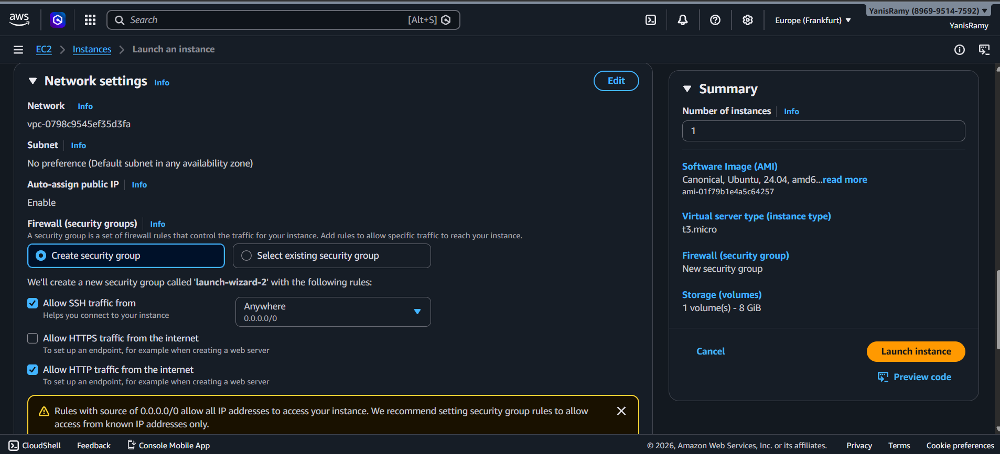
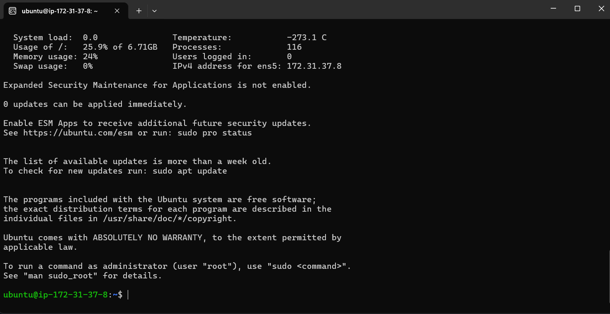

# DevOps Project Report: Automated CI/CD Pipeline for a 2-Tier Flask Application on AWS


**Author:** Oulad Daoud Yanis Ramy  
**Date:** March 10, 2026  

---

### **Table of Contents**
1. [Project Overview](#1-project-overview)
2. [Architecture Diagram](#2-architecture-diagram)
3. [Step 1: AWS EC2 Instance Preparation](#3-step-1-aws-ec2-instance-preparation)
4. [Step 2: Install Dependencies on EC2](#4-step-2-install-dependencies-on-ec2)
5. [Step 3: Jenkins Installation and Setup](#5-step-3-jenkins-installation-and-setup)
6. [Step 4: GitHub Repository Configuration](#6-step-4-github-repository-configuration)
7. [Step 5: Jenkins Pipeline Creation and Execution](#7-step-5-jenkins-pipeline-creation-and-execution)
8. [Conclusion](#8-conclusion)
9. [Infrastructure Diagram](#9-infrastructure-diagram)
10. [Work flow Diagram](#10-work-flow-diagram)
11. [External Links](#11-external-links)

---

### **1. Project Overview**
This project demonstrates deploying a 2-tier Flask + MySQL application on AWS EC2 with Docker, Docker Compose, and Jenkins CI/CD automation. Every push to GitHub triggers a pipeline that builds and deploys the application.

---

### **2. Architecture Diagram**


+-----------------+ +----------------------+ +-----------------------------+
| Developer |----->| GitHub Repo |----->| Jenkins Server |
| (pushes code) | | (Source Code Mgmt) | | (on AWS EC2) |
+-----------------+ +----------------------+ | |
| 1. Clones Repo |
| 2. Builds Docker Image |
| 3. Runs Docker Compose |
+--------------+--------------+
|
| Deploys
v
+-----------------------------+
| Application Server |
| (Same AWS EC2) |
| |
| +-------------------------+ |
| | Docker Container: Flask | |
| +-------------------------+ |
| | |
| v |
| +-------------------------+ |
| | Docker Container: MySQL | |
| +-------------------------+ |
+-----------------------------+


---

### **3. Step 1: AWS EC2 Instance Preparation**
  


---

### **4. Step 2: Install Dependencies on EC2**
```bash
sudo apt update && sudo apt upgrade -y
sudo apt install git docker.io docker-compose-v2 -y
sudo systemctl start docker
sudo systemctl enable docker
sudo usermod -aG docker $USER
newgrp docker
5. Step 3: Jenkins Installation and Setup
sudo apt install openjdk-17-jdk -y
curl -fsSL https://pkg.jenkins.io/debian-stable/jenkins.io-2023.key | sudo tee /usr/share/keyrings/jenkins-keyring.asc > /dev/null
echo deb [signed-by=/usr/share/keyrings/jenkins-keyring.asc] https://pkg.jenkins.io/debian-stable binary/ | sudo tee /etc/apt/sources.list.d/jenkins.list > /dev/null
sudo apt update
sudo apt install jenkins -y
sudo systemctl start jenkins
sudo systemctl enable jenkins
sudo cat /var/lib/jenkins/secrets/initialAdminPassword
sudo usermod -aG docker jenkins
sudo systemctl restart jenkins
6. Step 4: GitHub Repository Configuration
Dockerfile
FROM python:3.9-slim
WORKDIR /app
RUN apt-get update && apt-get install -y gcc default-libmysqlclient-dev pkg-config && rm -rf /var/lib/apt/lists/*
COPY requirements.txt .
RUN pip install --no-cache-dir -r requirements.txt
COPY . .
EXPOSE 5000
CMD ["python", "app.py"]
docker-compose.yml
version: "3.8"
services:
  mysql:
    container_name: mysql
    image: mysql
    environment:
      MYSQL_DATABASE: "devops"
      MYSQL_ROOT_PASSWORD: "root"
    ports:
      - "3306:3306"
    volumes:
      - mysql-data:/var/lib/mysql
    networks:
      - two-tier
    restart: always

  flask:
    build: .
    container_name: two-tier-app
    ports:
      - "5000:5000"
    environment:
      - MYSQL_HOST=mysql
      - MYSQL_USER=root
      - MYSQL_PASSWORD=root
      - MYSQL_DB=devops
    networks:
      - two-tier
    depends_on:
      - mysql
    restart: always

volumes:
  mysql-data:

networks:
  two-tier:
Jenkinsfile
pipeline {
    agent any
    stages {
        stage('Clone Code') {
            steps {
                git branch: 'main', url: 'https://github.com/YanisRamy/Two-Tier-Flask-App-DevOps.git'
            }
        }
        stage('Build Docker Image') {
            steps {
                sh 'docker build -t flask-app:latest .'
            }
        }
        stage('Deploy with Docker Compose') {
            steps {
                sh 'docker compose down || true'
                sh 'docker compose up -d --build'
            }
        }
    }
}
7. Step 5: Jenkins Pipeline Creation and Execution

Create a Pipeline job in Jenkins → Use Pipeline script from SCM → Git URL → Script path Jenkinsfile

Run Build Now → Verify Flask app at http://<ec2-public-ip>:5000

Monitor pipeline logs in Jenkins Stage View.

8. Conclusion

The CI/CD pipeline is fully automated. Every git push triggers Jenkins to build and deploy the app automatically.

9. Infrastructure Diagram


10. Work flow Diagram

